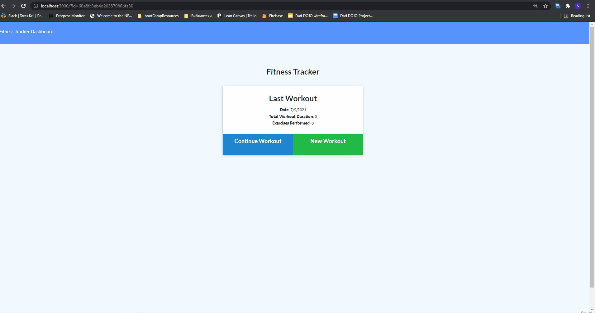

   <h1>Title Name:  Workout Tracker </h1>

## Description :

As a user, I want to be able to view create and track daily workouts. I want to be able to log multiple exercises in a workout on a given day. I should also be able to track the name, type, weight, sets, reps, and duration of exercise. If the exercise is a cardio exercise, I should be able to track my distance traveled.

   <h3>## Content :

- [Description](#description)
- [Instruction](#instructions)
- [Usage](#usage)
- [Contributers](#contributers)
- [GitHub](#GitHub)
- [Email](#mail)
</h3>

## Instruction :

npm i

## Usage :

node start

## Contributers :

Sergey Ishimov

## GitHub : (https://github.com/Sergey-ddbug)

## Email : sishimov@gmail.com

